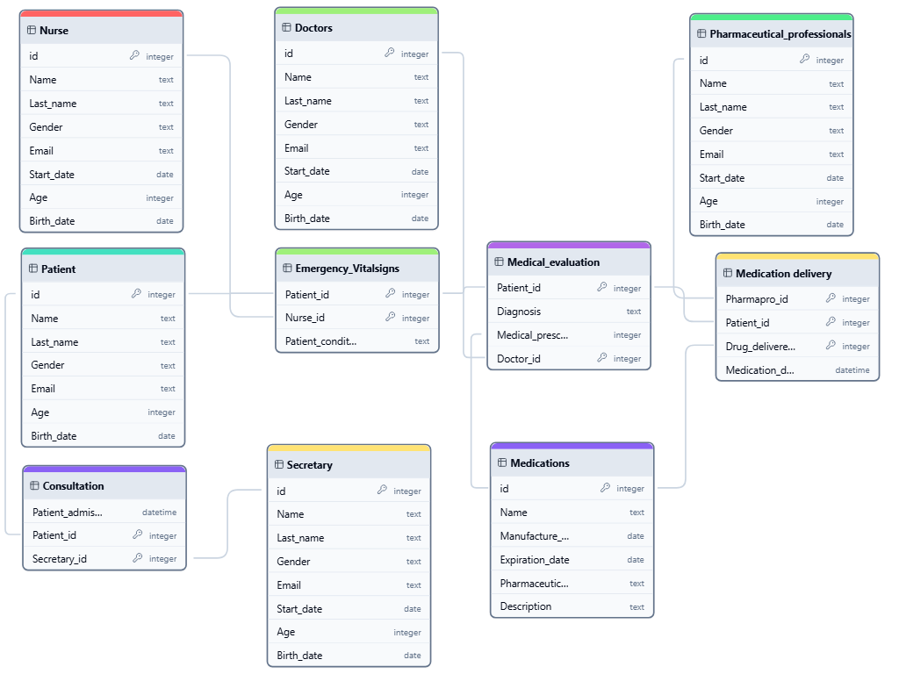

# Design Document

By Francisco Javier Ponce Garcia

Video overview: <https://www.youtube.com/watch?v=e7edw2Vo8Kk>

## Scope

The database for CS50 SQL includes all entities necessary to facilitate the process of tracking progress, diagnosis and prescription of medicine to a patient in to a medical facility, on a simple model of the reality. As such, included in the database's scope is:

* Patients and Workers of the medical facility (Doctors, Nurses, pharmaceutical professionals and secretaries), including their obligatory identifying information
* Consultation, Emergency, vital signs and medical evaluation, including diagnoses and prescriptions, patient current vital conditions, and the registration of patients into the facility
* Medications and medications delivery, which includes the information of each drug stored in the facility and the records of the delivery of medications to patients

## Functional Requirements

This database will support:

* CRUD operations for patients, workers ( hiring or firing [Doctors, Nurses, pharmaceutical professionals and secretaries]) and Medication
* The hability to track each patient progress into the medical facilty
* Tracking of all of the Medication details available (Name, Manufacture_date, Expiration_date, Pharmaceutical_company, Description)
* Direct tracking of each people involved on one patient

The actual structures will not support medication,patient or workers without identifying information.

## Representation

Entities are captured in SQlite tables with the following schema.

### Entities

#### Patients

The `Patients` table includes:

* `id`, which specifies the unique ID for the patient as an `INTEGER`. This column thus has the `PRIMARY KEY` constraint applied.
* `name`, which specifies the patient's first name as `TEXT`, given `TEXT` is appropriate for name fields.
* `last_name`, which specifies the patient's last name as `TEXT`. .
* `Gender`, which specifies the patient's gender as `TEXT`.
* `Email`, which specifies the patient's email as `TEXT`.
* `Age`, which specifies the patient's age as `INTEGER`.
* `Birth_date`, which specifies the patient's birth date as `date`.

#### Doctors

The `Doctors` table includes:

* `id`, which specifies the unique ID for the doctor as an `INTEGER`. This column thus has the `PRIMARY KEY` constraint applied.
* `name`, which specifies the doctor first name as `TEXT`, given `TEXT` is appropriate for name fields.
* `last_name`, which specifies the doctor last name as `TEXT`. .
* `Gender`, which specifies the doctor gender as `TEXT`.
* `Email`, which specifies the doctor email as `TEXT`.
* `Age`, which specifies the doctor age as `INTEGER`.
* `Birth_date`, which specifies the doctor birth date as `date`.
* `Start_date`, which specifies the doctor starting working date as `date`.

#### Nurse

The `Nurse` table includes:

* `id`, which specifies the unique ID for the nurse as an `INTEGER`. This column thus has the `PRIMARY KEY` constraint applied.
* `name`, which specifies the nurse first name as `TEXT`, given `TEXT` is appropriate for name fields.
* `last_name`, which specifies the nurse last name as `TEXT`. .
* `Gender`, which specifies the nurse gender as `TEXT`.
* `Email`, which specifies the nurse email as `TEXT`.
* `Age`, which specifies the nurse age as `INTEGER`.
* `Birth_date`, which specifies the nurse birth date as `date`.
* `Start_date`, which specifies the nurse starting working date as `date`.

#### Pharmaceutical professionals

The `Pharmaceutical_professionals` table includes:

* `id`, which specifies the unique ID for the Pharmaceutical professional as an `INTEGER`. This column thus has the `PRIMARY KEY` constraint applied.
* `name`, which specifies the Pharmaceutical professional first name as `TEXT`, given `TEXT` is appropriate for name fields.
* `last_name`, which specifies the Pharmaceutical professional last name as `TEXT`. .
* `Gender`, which specifies the Pharmaceutical professional gender as `TEXT`.
* `Email`, which specifies the Pharmaceutical professional email as `TEXT`.
* `Age`, which specifies the Pharmaceutical professional age as `INTEGER`.
* `Birth_date`, which specifies the Pharmaceutical professional birth date as `date`.
* `Start_date`, which specifies the Pharmaceutical professional starting working date as `date`.

#### Secretary

The `Secretary` table includes:

* `id`, which specifies the unique ID for the Secretary as an `INTEGER`. This column thus has the `PRIMARY KEY` constraint applied.
* `name`, which specifies the Secretary first name as `TEXT`, given `TEXT` is appropriate for name fields.
* `last_name`, which specifies the Secretary last name as `TEXT`. .
* `Gender`, which specifies the Secretary gender as `TEXT`.
* `Email`, which specifies the Secretary email as `TEXT`.
* `Age`, which specifies the Secretary age as `INTEGER`.
* `Birth_date`, which specifies the Secretary birth date as `date`.
* `Start_date`, which specifies the Secretary starting working date as `date`.

#### Consultation

The `Consultion` table includes:

* `patient.id`, which specifies the ID of the patient as an `Integer`. This column thus has the `FOREIGN KEY` constraint applied, referencing the `id` column in the `Patient` table, which ensures that each patient has a unique consult with a unique secretary.
* `secretary_id`, which specifies the ID of the secretary as an `Integer`. This column thus has the `FOREIGN KEY` constraint applied, referencing the `id` column in the `Secretary` table, which ensures that each patient has a unique consult with a unique secretary.
* Composite Primary Key: `secretary_id`, `patient_id`
* `patient_admission_date`, which specifies the date of the patient getting into the consult as a `datetime`

#### Emergency Vitalsigns

The `Emergency Vitalsigns` table includes:

* `patient_id`, which specifies the ID of the patient as an `Integer`. This column thus has the `FOREIGN KEY` constraint applied, referencing the `id` column in the `Patient` table.
* `nurse_id`, which specifies the ID of the specific Nurse as an `Integer`. This column thus has the `FOREIGN KEY` constraint applied, referencing the `id` column in the `Nurse` table, which ensures that each patient has a unique reviewed Emergency and Vitalsigns by a unique nurse.
* Composite Primary Key: `Nurse_id`, `Patient_id`
* `patient_condition`, which specifies and tracks the emergency situations and vitals signs recorded bt nurses for each patient AS `text`.

#### Medical evaluation

The `Medical_evaluation` table includes:

* `Patient_id`, which specifies the ID of the patient as an `Integer`. This column thus has the `FOREIGN KEY` constraint applied, referencing the `id` column in the `Patient` table.
* `Doctor_id`, which specifies the ID of the specific Doctor as an `Integer`. This column thus has the `FOREIGN KEY` constraint applied, referencing the `id` column in the `Doctors` table, which ensures that each patient has a unique Medical evaluation by a unique doctor.
* Composite Primary Key: `Patient_id`, `Doctor_id`
* `Medical_prescription`, which specifies the drugs of need for each patient AS `INT`. It also works as a `FOREIGN KEY` to reference the correct `id` on the given medicine in to the `Medications` table.
* `Diagnosis`, which represents the medical situation of the patient as a `text`

#### Medication delivery

The `Medication_delivery` table includes:

* `Patient_id`, which specifies the ID of the patient as an `Integer`. This column thus has the `FOREIGN KEY` constraint applied, referencing the `id` column in the `Patient` table.
* `pharmapro_id`, which specifies the ID of the specific pharmacologist as an `Integer`. This column thus has the `FOREIGN KEY` constraint applied, referencing the `id` column in the `Pharmaceutical_professionals` table, which ensures that each patient has a unique relatitionship with the delivery of the drugs by a proper Pharmaceutical professional.
* `Drug_delivered_id`, which specifies the drugs of need for each patient AS `INT`. It also works as a `FOREIGN KEY` to reference the correct `id` on the given medicine in to the `Medications` table.
* Composite Primary Key: `Patient_id`, `Pharmapro_id, Drug_delivered_id`
* `Medication_delivery_date` as a `datetime` to store the exact datetime of the delivery. Creating a table with the delivery records of medications to patients by pharmaceutical

#### Medication

The `Medication` table includes:

* `id`, which specifies the unique ID for the Secretary as an `INTEGER`. This column thus has the `PRIMARY KEY` constraint applied.
* `name`, which specifies the name of the drug as `TEXT`, given `TEXT` is appropriate for name fields.
* `Pharmaceutical_company`, which specifies the details of the pharmaceutical company who is producing the drug as a `TEXT`. .
* `Description`, which specifies a short description of the drug as `TEXT`.
* `Email`, which specifies the Secretary email as `TEXT`.
* `Age`, which specifies the Secretary age as `INTEGER`.
* `Manufacture_date`, which specifies the creation date as `date`.
* `Expiration_date`, which specifies the expiration date as `date`.

### Relationships

* Patient table has the purpose to store the essential information about each patient in the medical facility. This table has a 1:N relationship: Each patient can be linked to multiple entries in other tables like `Consultation`, `Emergency_vitalsigns`, `Medical_evaluation` and `Medication_delivery`

* Workers tables (Doctors, Nurse, Pharmaceutical_professionals, Secretary) has the purpose to store information about different types of mediccal professionals working in the facility. Their relantioship is 1:N, because each professional can be linked to multiple patients through various interactions suchs as consultations, evaluations, and medication deliveries.

* Medications table stores details about the medications available in the facility. Their relationship is 1:N, each medication can be referenced in multiple records in `Medical_evaluation` and `Medication_delivery`

* Consultation table records the regristration of patients into the facility, handled by the secretary. Their relationship is N:1, because each consultation is linked to one patient and one secretary, but a patient can have multiple consultations and a secretary can handle multiple patients.

* Emergency_vitalsigns table has a N:1 relantionship, because each record links a patient to a nurse during a medical review, but a patient can have multiple medical review and a nurse can attend to multiple patients.

* Medical_evaluation and Medication_delivery has a N:1 relationship.

## Optimizations

The three indexes applied to the tables were designed to optimize queries related to patients, as managing patient data is the primary function of the database. This includes optimizing searches based on the patient's id, Name, and Last_name.

Additionally, an index was created to improve the efficiency of medication searches, focusing on the columns id, Name, Manufacture_date, and Expiration_date. This ensures better control over the status of medications and their proper maintenance.

Lastly, the consultation table was optimized since all patient records are stored there, making it crucial for quick retrieval and management of consultation data.

## Limitations

* The current structure doesn't have a direct posibility of storing historical data of each patient, to see their medical evolution. But it can be solved with views and querys.
* The database is not able to represent a real and complex medical facility, because it would require an incredible amount of time to develop
